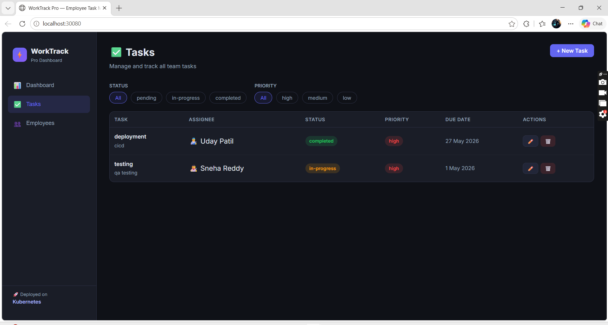

# WorkTrack Pro — Employee Task Management System on Kubernetes

> A production-grade microservices application deployed on Kubernetes demonstrating real-world DevOps practices.


---

## What is WorkTrack Pro?

**WorkTrack Pro** is a modern, responsive Employee Task Management Dashboard designed for enterprise teams to track productivity, task progress, and workload distribution in real-time. It provides a visual dashboard for managers to monitor team bandwidth, assign/edit tasks, and analyze task completion rates across the organization.

### 🏢 Real-World Business Scenario

Imagine a software engineering company, **TechCorp**, with a fast-growing team of developers and multiple active projects:

1. **Identifying Overload:** An Engineering Manager logs into **WorkTrack Pro** and reviews the **Employees** tab. They see that *Alice* is assigned 8 tasks (with a 25% completion rate), while *Bob* has only 1 task assigned.
2. **Rebalancing the Workload:** The Manager switches to the **Tasks** tab, filters tasks by *Alice*, finds a high-priority "Database Schema Migration" task, and edits it to reassign it to *Bob* with an updated due date.
3. **Real-Time Data Persistence:** The React frontend securely sends this change to the Node.js API backend. The backend updates PostgreSQL, invalidates the old cached statistics in Redis, and immediately broadcasts the updated data.
4. **Instantly Updated Metrics:** The Manager returns to the **Dashboard** and sees the overall completion rate and employee workload metrics recalculate instantly, ensuring data consistency across the team.

---

## 📸 Project Screenshots

### 📊 Application Dashboard


### 👥 Team Management & Bandwidth Overview


### ✅ Task CRUD Board & Status Filters


### ☸️ Kubernetes Cluster Resources & Deployments (CLI)


---

## Architecture

```
                    ┌─────────────────────────────────────┐
                    │         Kubernetes Cluster           │
                    │          (Namespace: worktrack)      │
                    │                                      │
  Browser ──────►  │  [Frontend - React/Nginx]            │
  port 30080        │       │                              │
                    │       ▼                              │
                    │  [Backend - Node.js API] ×2 replicas│
                    │       │              │               │
                    │       ▼              ▼               │
                    │  [PostgreSQL]    [Redis Cache]       │
                    │   + PVC Storage                      │
                    └─────────────────────────────────────┘
```

## Services

| Service | Technology | Role | K8s Service Type |
|---------|-----------|------|-----------------|
| **frontend** | React + Vite + Nginx | Dashboard UI | NodePort (30080) |
| **backend** | Node.js + Express | REST API | ClusterIP |
| **postgres** | PostgreSQL 15 | Primary Database | ClusterIP |
| **redis** | Redis 7 | API Cache | ClusterIP |

## Features

- 📊 **Dashboard** — Real-time task statistics with progress tracking
- ✅ **Task Management** — Full CRUD with status, priority, and assignee filtering
- 👥 **Employee View** — Team overview with per-person task completion stats
- ⚡ **Redis Caching** — API responses cached for performance
- 🔄 **Auto-scaling** — HPA scales backend 2→5 pods based on CPU load

---

## Kubernetes Concepts Demonstrated

| Concept | File | Purpose |
|---------|------|---------|
| **Namespace** | `namespace.yaml` | Isolate all app resources |
| **Deployment** | `*-deployment.yaml` | Manage pod lifecycle & replicas |
| **ConfigMap** | `configmap.yaml` | Non-sensitive configuration |
| **Secret** | `secret.yaml` | Encrypted DB credentials |
| **PersistentVolumeClaim** | `postgres-pvc.yaml` | Persistent DB storage |
| **ClusterIP Service** | `services.yaml` | Internal pod communication |
| **NodePort Service** | `services.yaml` | External browser access |
| **HPA** | `hpa.yaml` | Horizontal auto-scaling |
| **Liveness Probe** | `backend-deployment.yaml` | Auto-restart unhealthy pods |
| **Readiness Probe** | `backend-deployment.yaml` | Traffic routing control |
| **Resource Limits** | All deployments | CPU & Memory constraints |

---

## Project Structure

```
worktrack-pro/
├── frontend/               # React + Vite application
│   ├── src/
│   │   ├── App.jsx
│   │   ├── index.css
│   │   └── components/
│   │       ├── Dashboard.jsx
│   │       ├── TaskList.jsx
│   │       └── EmployeeList.jsx
│   ├── Dockerfile
│   └── nginx.conf
│
├── backend/                # Node.js REST API
│   ├── src/
│   │   ├── index.js
│   │   ├── db.js
│   │   └── routes/
│   │       ├── tasks.js
│   │       └── employees.js
│   └── Dockerfile
│
└── k8s/                    # Kubernetes manifests
    ├── namespace.yaml
    ├── configmap.yaml
    ├── secret.yaml
    ├── postgres-pvc.yaml
    ├── postgres-deployment.yaml
    ├── redis-deployment.yaml
    ├── backend-deployment.yaml
    ├── frontend-deployment.yaml
    ├── services.yaml
    └── hpa.yaml
```

---

## How to Deploy

### Prerequisites
- Google Cloud Platform (GCP) account with GKE enabled
- `gcloud` CLI installed and authenticated
- `kubectl` configured

### Step 1 — Create GKE Cluster

```bash
gcloud auth login
gcloud config set project <YOUR-PROJECT-ID>
gcloud container clusters create worktrack-cluster --zone us-central1-a --machine-type e2-medium --num-nodes 2
```

### Step 2 — Deploy to Kubernetes

```bash
# Apply all manifests
kubectl apply -f k8s/

# Check everything is running
kubectl get all -n worktrack
```

### Step 3 — Access the App

Since the frontend service is exposed via **LoadBalancer** on GCP, it will automatically get a Public IP:

```bash
kubectl get svc frontend-service -n worktrack
```
Wait for the `EXTERNAL-IP` to be assigned, then open it in your browser:
👉 **http://<EXTERNAL-IP>**

---

## 🔄 GitOps Continuous Delivery with ArgoCD

This project is fully ready for **GitOps CD** using **ArgoCD**. 

An ArgoCD Application manifest is provided in [argocd/application.yaml](./argocd/application.yaml). It connects the cluster directly to this GitHub repository. Any changes pushed to the `k8s/` folder in Git will be automatically reconciled and deployed to your cluster, ensuring zero configuration drift.

### Setup Steps:

1. **Install ArgoCD on your cluster:**
   ```bash
   kubectl create namespace argocd
   kubectl apply -n argocd -f https://raw.githubusercontent.com/argoproj/argo-cd/stable/manifests/install.yaml
   ```

2. **Apply the ArgoCD Application:**
   ```bash
   kubectl apply -f argocd/application.yaml
   ```

3. **Access ArgoCD Dashboard:**
   ```bash
   kubectl port-forward -n argocd svc/argocd-server 8080:443
   ```
   * Open **[https://localhost:8080](https://localhost:8080)** in your browser.
   * **Username:** `admin`
   * **Password command:** 
     `kubectl -n argocd get secret argocd-initial-admin-secret -o jsonpath="{.data.password}"` (decode base64 to read).

---

## API Endpoints

| Method | Endpoint | Description |
|--------|----------|-------------|
| GET | `/health` | Health check (used by K8s probes) |
| GET | `/api/stats` | Dashboard statistics |
| GET | `/api/tasks` | List all tasks (filter by status/priority) |
| POST | `/api/tasks` | Create new task |
| PUT | `/api/tasks/:id` | Update task |
| DELETE | `/api/tasks/:id` | Delete task |
| GET | `/api/employees` | List employees with task counts |

---

## Tech Stack

- **Frontend**: React 18, Vite, CSS3 (Dark Theme)
- **Backend**: Node.js, Express, pg (PostgreSQL client), Redis client
- **Database**: PostgreSQL 15
- **Cache**: Redis 7
- **Container**: Docker, Nginx
- **Orchestration**: Google Kubernetes Engine (GKE)
- **Registry**: Docker Hub (`uday188/worktrack-*`)
- **CI/CD**: GitHub Actions & ArgoCD
