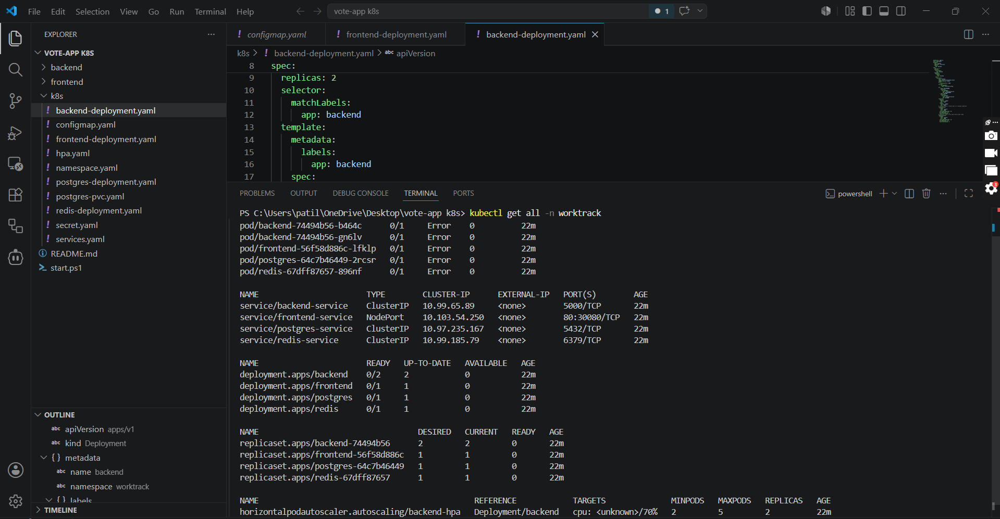
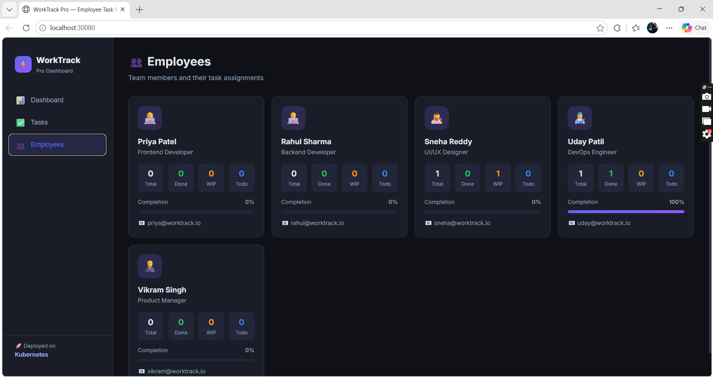
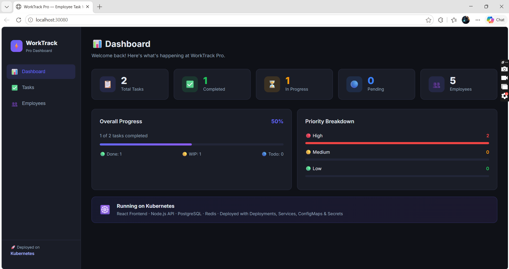

# 🚀 WorkTrack Pro — Employee Task Management on Kubernetes

> A **production-grade microservices application** deployed on **Google Kubernetes Engine (GKE)** with full **GitOps CI/CD** powered by **GitHub Actions** and **ArgoCD**.

<p align="center">
  
  
  
  
  
  
  
  
  
</p>

---

## 📌 What is WorkTrack Pro?

**WorkTrack Pro** is a modern, full-stack Employee Task Management Dashboard designed for engineering teams. It enables managers to track productivity, assign tasks, monitor workload distribution, and analyze completion rates — all in real-time.

This project demonstrates a complete **end-to-end DevOps workflow**:
- Code is written locally → Pushed to **GitHub**
- **GitHub Actions** automatically builds & pushes Docker images to **Docker Hub**
- **ArgoCD** watches the repo and automatically deploys changes to **GKE**

---

## 🏗️ Architecture Overview

```
  Developer
      │
      │  git push
      ▼
 ┌─────────────┐       GitHub Actions CI        ┌─────────────────┐
 │   GitHub    │ ──────────────────────────────► │   Docker Hub    │
 │  Repository │                                 │  (Images Store) │
 └──────┬──────┘                                 └─────────────────┘
        │
        │  ArgoCD watches k8s/ folder (GitOps)
        ▼
 ┌──────────────────────────────────────────────────────────┐
 │              Google Kubernetes Engine (GKE)              │
 │                  Cluster: worktrack-cluster              │
 │                  Zone: us-central1-a  | Nodes: 2         │
 │                                                          │
 │  Namespace: worktrack                                    │
 │                                                          │
 │  [LoadBalancer]                                          │
 │      │                                                   │
 │      ▼                                                   │
 │  [Frontend - React/Nginx]  ←── Port 80                  │
 │      │                                                   │
 │      ▼                                                   │
 │  [Backend - Node.js API]   ×2 replicas (HPA: up to 5)   │
 │      │              │                                    │
 │      ▼              ▼                                    │
 │  [PostgreSQL 15]  [Redis 7]                              │
 │   + PVC Storage   (Cache Layer)                          │
 └──────────────────────────────────────────────────────────┘
```

---

## 📸 Live Screenshots

### 🌐 WorkTrack Pro — Live on GKE (Employees Page)
> App live at `http://35.253.124.176` with Kiran Sonawane added via GitOps workflow


---

### 🔄 ArgoCD — GitOps CD Dashboard (Synced ✅)
> ArgoCD v3.4.2 watching `erudaydevops/worktrack-pro-k8s` repo — Status: **Synced**


---

### ☁️ GKE Console — worktrack-cluster Running
> Cluster details on Google Cloud Console — **Status: Running**, 2 Nodes, Zone: us-central1-a


---

### ⌨️ Cloud Shell — kubectl Pods & Services Live
> Real kubectl output showing all pods Running and LoadBalancer External IP assigned


---

### 📊 Application Dashboard


### ✅ Task CRUD Board & Status Filters


### ☸️ Kubernetes Cluster Resources (CLI)


---

## 🔄 CI/CD Pipeline — How It Works

```
 ┌────────────────────────────────────────────────────────────┐
 │                   CI/CD Pipeline Flow                      │
 │                                                            │
 │  1. git push → master branch                               │
 │         │                                                  │
 │         ▼                                                  │
 │  2. GitHub Actions triggers (.github/workflows/ci.yml)     │
 │         │                                                  │
 │         ├──► Build Backend Docker Image                    │
 │         │         └──► Push → uday188/worktrack-backend    │
 │         │                                                  │
 │         └──► Build Frontend Docker Image                   │
 │                   └──► Push → uday188/worktrack-frontend   │
 │                                                            │
 │  3. ArgoCD polls GitHub repo every 3 minutes               │
 │         │                                                  │
 │         ▼                                                  │
 │  4. Detects changes in k8s/ folder                         │
 │         │                                                  │
 │         ▼                                                  │
 │  5. Auto-syncs → Deploys to GKE cluster ✅                 │
 └────────────────────────────────────────────────────────────┘
```

---

## 🧩 Services & Tech Stack

| Service | Technology | Role | K8s Service Type |
|---------|-----------|------|-----------------|
| **frontend** | React 18 + Vite + Nginx | Dashboard UI | LoadBalancer |
| **backend** | Node.js + Express | REST API | ClusterIP |
| **postgres** | PostgreSQL 15 Alpine | Primary Database | ClusterIP |
| **redis** | Redis 7 Alpine | API Cache Layer | ClusterIP |

---

## ☸️ Kubernetes Concepts Demonstrated

| Concept | File | Purpose |
|---------|------|---------|
| **Namespace** | `namespace.yaml` | Isolate all app resources in `worktrack` ns |
| **Deployment** | `*-deployment.yaml` | Manage pod lifecycle & rolling updates |
| **ConfigMap** | `configmap.yaml` | Non-sensitive environment configuration |
| **Secret** | `secret.yaml` | Encrypted DB credentials (base64) |
| **PersistentVolumeClaim** | `postgres-pvc.yaml` | Persistent DB storage (survives pod restart) |
| **ClusterIP Service** | `services.yaml` | Internal pod-to-pod communication |
| **LoadBalancer Service** | `services.yaml` | Public internet access via GCP IP |
| **HPA** | `hpa.yaml` | Auto-scale backend: 2 → 5 pods on CPU load |
| **Liveness Probe** | `backend-deployment.yaml` | Auto-restart unhealthy pods |
| **Readiness Probe** | `backend-deployment.yaml` | Only route traffic to ready pods |
| **Resource Limits** | All deployments | CPU & Memory constraints per pod |

---

## 🗂️ Project Structure

```
worktrack-pro-k8s/
│
├── .github/
│   └── workflows/
│       └── ci.yml              # GitHub Actions — Build & Push Docker images
│
├── frontend/                   # React + Vite application
│   ├── src/
│   │   ├── App.jsx
│   │   ├── index.css
│   │   └── components/
│   │       ├── Dashboard.jsx
│   │       ├── TaskList.jsx
│   │       └── EmployeeList.jsx
│   ├── Dockerfile
│   └── nginx.conf
│
├── backend/                    # Node.js REST API
│   ├── src/
│   │   ├── index.js
│   │   ├── db.js               # DB init & seed data
│   │   └── routes/
│   │       ├── tasks.js
│   │       └── employees.js
│   └── Dockerfile
│
├── k8s/                        # Kubernetes Manifests (watched by ArgoCD)
│   ├── namespace.yaml
│   ├── configmap.yaml
│   ├── secret.yaml
│   ├── postgres-pvc.yaml
│   ├── postgres-deployment.yaml
│   ├── redis-deployment.yaml
│   ├── backend-deployment.yaml
│   ├── frontend-deployment.yaml
│   ├── services.yaml
│   └── hpa.yaml
│
└── argocd/
    └── application.yaml        # ArgoCD Application manifest
```

---

## 🚀 How to Deploy (GKE + ArgoCD)

### Prerequisites
- Google Cloud Platform account (GKE API enabled)
- `gcloud` CLI installed and authenticated
- `kubectl` installed
- Docker Hub account
- GitHub repository with Secrets configured

### Step 1 — Add GitHub Secrets
Go to your GitHub repo → **Settings → Secrets → Actions** and add:

| Secret Name | Value |
|-------------|-------|
| `DOCKER_USERNAME` | Your Docker Hub username |
| `DOCKER_PASSWORD` | Your Docker Hub password/token |

### Step 2 — Create GKE Cluster

```bash
# Login to GCP
gcloud auth login
gcloud config set project <YOUR-PROJECT-ID>

# Create the cluster (e2-medium, 2 nodes, us-central1-a)
gcloud container clusters create worktrack-cluster \
  --zone us-central1-a \
  --machine-type e2-medium \
  --num-nodes 2

# Get cluster credentials for kubectl
gcloud container clusters get-credentials worktrack-cluster --zone us-central1-a
```

### Step 3 — Deploy App to Kubernetes

```bash
# Apply all Kubernetes manifests
kubectl apply -f k8s/

# Verify all pods are running
kubectl get pods -n worktrack

# Get the public IP of the app
kubectl get svc frontend-service -n worktrack
```

Open browser → `http://<EXTERNAL-IP>`

### Step 4 — Install ArgoCD on Cluster

```bash
# Create ArgoCD namespace and install
kubectl create namespace argocd
kubectl apply -n argocd -f https://raw.githubusercontent.com/argoproj/argo-cd/stable/manifests/install.yaml

# Wait for pods to be ready
kubectl get pods -n argocd

# Expose ArgoCD with a LoadBalancer
kubectl patch svc argocd-server -n argocd -p '{"spec": {"type": "LoadBalancer"}}'

# Get ArgoCD public IP
kubectl get svc argocd-server -n argocd
```

### Step 5 — Deploy ArgoCD Application

```bash
# Apply the ArgoCD Application manifest
kubectl apply -f argocd/application.yaml
```

### Step 6 — Access ArgoCD Dashboard

```bash
# Get the initial admin password
kubectl -n argocd get secret argocd-initial-admin-secret \
  -o jsonpath="{.data.password}" | base64 -d; echo
```

Open browser → `https://<ARGOCD-EXTERNAL-IP>`
- **Username:** `admin`
- **Password:** (from command above)

> From this point, every `git push` to the repo will automatically trigger GitHub Actions (build & push Docker images) and ArgoCD will auto-sync the cluster! 🎉

---

## 🌐 API Endpoints

| Method | Endpoint | Description |
|--------|----------|-------------|
| GET | `/health` | Health check (used by K8s probes) |
| GET | `/api/stats` | Dashboard statistics |
| GET | `/api/tasks` | List all tasks (filter by status/priority) |
| POST | `/api/tasks` | Create new task |
| PUT | `/api/tasks/:id` | Update task |
| DELETE | `/api/tasks/:id` | Delete task |
| GET | `/api/employees` | List employees with task counts |

---

## 🏢 Real-World Business Scenario

Imagine a software company **TechCorp** using WorkTrack Pro to manage their engineering team:

1. **Manager logs in** and sees the **Employees** tab showing all team members with task stats
2. **Identifies overload** — one engineer has 8 tasks, another has none
3. **Rebalances** — switches to Tasks tab, reassigns a task to another engineer
4. **Real-time update** — React frontend calls Node.js API → PostgreSQL updates → Redis cache invalidates → Dashboard shows new stats instantly
5. **GitOps in action** — When a new employee (e.g., *Kiran Sonawane*) is added to the codebase, GitHub Actions builds new image → ArgoCD deploys to GKE automatically

---

## 🛠️ Full Tech Stack

| Layer | Technology |
|-------|-----------|
| **Frontend** | React 18, Vite, CSS3 (Dark Theme) |
| **Backend** | Node.js, Express.js |
| **Database** | PostgreSQL 15 Alpine |
| **Cache** | Redis 7 Alpine |
| **Containerization** | Docker, Nginx |
| **Orchestration** | Google Kubernetes Engine (GKE) |
| **Container Registry** | Docker Hub (`uday188/worktrack-*`) |
| **CI Pipeline** | GitHub Actions |
| **CD Pipeline** | ArgoCD v3.4.2 (GitOps) |
| **Cloud Provider** | Google Cloud Platform (GCP) |
| **Cluster Zone** | us-central1-a |

---

## 👥 Team

| Name | Role |
|------|------|
| Uday Patil | DevOps Engineer |
| Kiran Sonawane | DevOps Engineer |

---

<p align="center">Made with ❤️ | Deployed on Google Kubernetes Engine | Managed by ArgoCD</p>
